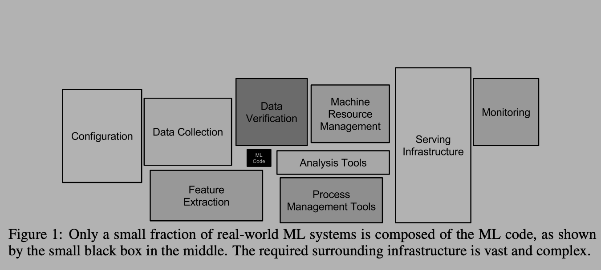
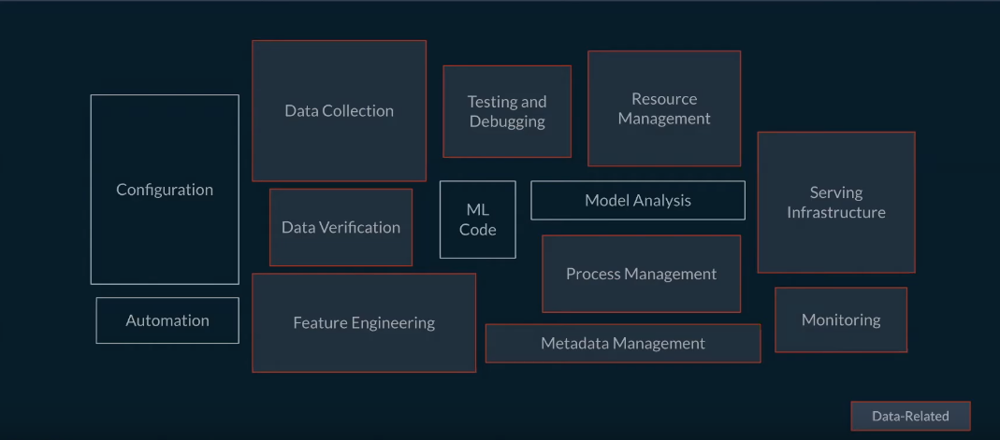

In this post, I'll talk about `Feature Store`, the new essential component of a modern Machine Learning infrastructure. We'll look at what a production ML system looks like and where does a `Feature Store` fit into it. We'll dive into some issues that a `Feature Store` is supposed to solve. Finally, we'll take a look at some core problems and some possible solutions to these problems either in open-source world or how big tech companies solve it. A combination of these solutions is essentially your `Feature Store` infrastructure.

+ [Production ML Systems](#production-ml-systems)
+ [Feature Store](#feature-stores)
  - [Feature consistency](#feature-consistency)
  - [Time travel](#time-travel)
  - [Feature Engineering](#feature-engineering)
  - [Reusable Dataset](#reusable-datasets)
  - [Online serving](#online-serving)
  - [Metadata management](#metadata-management)
  - [Data governance](#data-governance)
* [Conclusion](#conclusion)
* [References](#references)

<small><i><a href='http://ecotrust-canada.github.io/markdown-toc/'>Table of contents generated with markdown-toc</a></i></small>

### Production ML systems:
First, let's see what differentiates a real-world production ML systems with ML research prototypes, Kaggle based machine learning competitions, and the projects in ML courses. The distinction is best summarized in the diagram below:

As we can see, the part where actual ML modeling happens (indicated with `ML Code`) is a tiny portion of a much larger system. Traditionally, in college courses and online MOOCs a large emphasis is placed on `ML Code`. I think the primary reason is that it is difficult to teach and assess some of the other skills shown in the diagram. However, the other boxes make up most of what a production-grade ML system looks like.

If Machine Learning is a major aspect of your business, then having a strong infrastructure around your `ML Code` is must. I like to compare it to traditional large scale software systems where it is a must to have a version-controlled code base, CI/CD pipelines, compute and data infrastructure support, etc. for engineers to be effective and for your technical pillar to be strong.

Since ML is a relatively new software paradigm, a lot of the support around ML systems is either missing or is still developing. As mentioned by Andrej Karpathy in his [talk](https://www.youtube.com/watch?v=y57wwucbXR8), we need to build a new software stack for AI and ML, and managing data/features (in addition to code) is a big aspect of this new stack.

In this post, I want to dive into a specific piece of infrastructure that deals with features: the data that helps you build your ML models and make your ML products successful. At least when it comes to structured data, a large part of ML use-cases is designing good features for your models. However, it doesn't stop at that. If you are running a business on machine learning, then you want to know the following about your features:
- is it available offline for Training and online for Serving
- how does one read/load features offline and online
- is there consistency between offline and online computations
- how good is the quality of features
- who is producing these features
- who is consuming these features
- are there SLAs around some/all of these features
- how does one team discover features created by other

There are many more such questions that need to be answered about the data goes into your ML models, and the models that power your business. Hence, there is a need for good tooling and infrastructure around features. `Feature Store` is a relatively new infrastructure solution to answer these questions. Though there are not a lot of mainstream solutions out there, big tech companies in ML space have built some custom infrastructure for this.

Note: There are now companies like [Tecton](tecton.ai) and [Hopsworks](hopsworks.ai) who offer end-to-end enterprise grade solutions.

### Feature Store
From the name it may seem like, we are building a data-store that stores our features, but it is much more than that. Below is a slide taken from [Tecton's talk](https://www.youtube.com/watch?v=ZXkra9jiCU0) to highlight the components that a good feature store will manage.

For e.g. `Serving Infrastructure` consists of not just the model that is being served but also the features or feature-transformation logic.

`Feature Store` is thus not just a place for you to store and retrieve your features from. It is also the infrastructure to: create those features, manage metadata around the features, make features discoverable, make it consistently available offline and online, monitor the quality of the features, and in some cases even provide consistent API for performing feature engineering.

Now that we know what a feature store is roughly supposed to do, let's dive into some core problems that Data scientists and ML Engineers face and how a good `Feature Store` can solve those problems.

#### Feature Consistency
Feature consistency affects the ML use-cases where predictions are made in real-time, i.e. the predictions are not pre-computed and served as is without any computation at request time. In real-time serving, we get some request, extract features based on the request, feed it into the model and return the prediction. A fair number of business-driving production use-cases fall under this: CTR prediction, Search Ranking, Home feed ranking, Transaction fraud prediction, etc, so this is definitely a problem worth solving. Wait, what exactly is the problem here?

When a DS/MLE builds a model to solve a problem (e.g. CTR prediction), the process usually looks like this:
1. Get data from Data-warehouse or Data-lake
2. Do feature engineering: transform your strings to one-hot, compute historical aggregates and so on (usually done in Python-based-stack: Pandas, NumPy, PySpark)
3. Train your model on these features, evaluate for quality
4. Make it available for serving

The problem comes when you have to do feature-engineering/transformation online right before you feed your feature-vector to your model to make prediction. Where does that feature-engineering code live? DS/MLE wrote in Python in their notebook but how does it translate to your low-latency Java service?

##### Option 1: Duplicate the code

We can to duplicate the code between offline training and online serving systems. Some companies do this by structuring ML teams such that DS write feature engineering code in Python in notebooks, MLE write the same code in Java for serving. In my opinion, this is quite risky especially if your training and serving environments are different (Python v/s Java). Moreover, it's just bad practice to have duplicate code in different systems having to do the same thing. In addition to that, it's really difficult to make sure that the computation between offline and online systems are exactly the same. A common way in which this problem surfaces is when your model performs really well offline but does poorly online. A good place to investigate this is to look at the features computed online. Having a good monitoring system to measure offline/online feature-drift also helps, though it doesn't solve the core problem of having duplicated logic in 2 places in your ML system.

##### Option 2: Shared library/computation-logic

Here, we do not have duplicate code but have a shared library that performs feature engineering. This is doable if your training and serving systems _can_ use the same library. This becomes tricky with Pandas/NumPy based feature engineering (unless your serving system is in Python). However, this can be done if you use PySpark for feature engineering. PySpark being just a wrapper on top of Scala-Spark essentially performs computations on JVM. So if your online low-latency serving system is in Java or other JVM based system, this is a reasonable solution to feature consistency problem. This is what we do at Yelp for our ads-targeting (ctr prediction) models. For more details, you can check out my [blog on Yelp engineering](https://engineeringblog.yelp.com/2020/01/modernizing-ads-targeting-machine-learning-pipeline.html)

##### Option 3: One compute, Two DB

Here, we have features computed and loaded into an offline DW/Datalake as well as online database (such as Cassandra for high availability). This requires all features to be computed and stored in these data-stores. For training, we read from offline DB, for serving we read from online DB. The tricky part here is maintaining the two data stores in sync and making sure same computation logic computes features for both. And a limitation is that when you have to add new features you've to do a massive backfill (usually manually) and make it available offline for training. Most feature-stores use this approach and solve the two issues: shared computation logic and backfills. Big tech companies in ML space (Facebook, Uber, Airbnb) have developed some sort of DSL for shared computation logic so developers don't have to write the code twice, which is pretty neat, but also not easy to integrate into different systems as they could be very domain/company specific.

#### Time travel

That sounds like sci-fi but it basically means, given a point of time, what was the value of this particular feature at that point of time. DS/MLE often need this to create their dataset where use existing labels and collect historical point-in-time feature-values to create the ML models.

This is often not available in traditional DB solutions unless for each schema that contains our features, we add an event-time column. And one can image this data growing to be super large to be stored in a traditional DB.

A more appropriate solution in this case is storing your snapshot or changelogs partitioned by time on Datalake. So we store all the updates partitioned by date/time and we can write Spark/SQL queries on top of it to answer question such as: what was the average rating given by this user from January 2020 to March 2020.

Thankfully this is provided as ready-to-use solutions by [AWS](https://aws.amazon.com/big-data/datalakes-and-analytics/) (using a bunch of AWS solutions such as S3, Glue, Athena, Kinesis), and [Databricks Delta](https://docs.databricks.com/delta/index.html). Delta can work on top of your existing Datalake and provide good data management solution on top of it.

A challenging aspect of this is to manage streaming data with change-logs on your datalake. Delta by Databricks provides a solution to this problem as well. One option is to not perform streaming updates, and run batch-incremental updates frequently on your changelogs, and this is usually good enough. For e.g. user's last 90 days of historical aggregate (average 90 day CTR of a user) won't change much every hour so it's alright to do it on a snapshot once per day. However, if last 10 searches made by the user is important for your model then you need streaming updates.

#### Feature Engineering

This problem is closely related to consistency problem, but this sits more close to DS/MLE rather than infrastructure folks. The problem is how to have a good set of libraries to do feature engineering and also have your feature definition be consistent. For e.g. there are libraries such as Pandas and PySpark which DS/MLE use for feature engineering and these are pretty powerful, but they have their subtle differences which can go unnoticed. So if one DS is computing one-hot encoding in Pandas, that might differ from one-hot encoding done in PySpark. So how do we provide a single interface for all DS/MLE to do feature engineering.

##### Option 1: Provide a DSL

This is a considerable effort in my opinion, especially for small companies with small engineering workforce, because it is partially reinventing the wheel. It has great returns I believe in the form of consistency between features, ease of use and deployment, ease of customization, improved iteration and development of new ML models. Big companies like Uber, Airbnb, Twitter have taken this approach and it has paid off well for them. They have thousands of ML models running in production created by hundreds of engineers.

##### Option 2: Use a single library

This can be limiting: what if this one library is not enough for your feature engineering needs? And can this library be used for serving too?
Some solution around this is to have your feature engineering library be in a language that can be used for serving and provide wrappers on top of it for interactive languages such as Python. I believe this is what Twitter does by providing wrappers on top of Scala (I am guessing).

##### Option 3: Shareable format and execution

If we can come up with a format and execution engine that can take my feature engineering pipeline written in Python using Scikit-learn and serialize it into a format that can be used by my Java inference service, then this problem is solved!

At Yelp, we have converged towards this solution. We don't limit our DS/MLE to use a single library like Pandas or PySpark but any library/feature engineering transforms **as long as they can be serialized** into a shareable format: [MLeap](https://mleap-docs.combust.ml/). For more about our ML platform, check out [this blog](https://engineeringblog.yelp.com/2020/07/ML-platform-overview.html). MLeap is relatively new but really powerful as it allows us to go between different training and serving environments and not limiting ourselves by having to use only one single library for feature engineering.

There are caveats such as not all transforms are available and serializable, but this is a growing community and I believe we'll have a good range of feature engineering transforms available soon.

[Apache Beam](https://beam.apache.org/) is also a solution in a similar vein that it decouples your computation logic (batch/streaming) with your serving environment by using a shareable Beam Model. I have not played around with this yet.

#### Reusable Dataset:
Most of the use-cases we discussed above (ctr prediction, search ranking, homefeed ranking, fraud detection) have a shared theme to them: the underlying data changes very often and hence you want to retrain your models often. To reduce the time to retrain and deploy fresher models, an often used solution is to materialize your dataset with new data points regularly, and then let your training batch pick up newly created rows, train a new model, evaluate it against older model and go into production. This is different from having a feature-store as datasets are very domain specific: a dataset created for CTR prediction cannot be used for ranking search results. However, they can share some same features (say user's preference towards an item category).

Usually, long term cheap storage such as S3/HDFS is used to materialize datasets. It is also a good idea to materialize data in a format that's suitable for your model-training library (TFRecord for Tensorflow v/s .npy for PyTorch, .h5 for Keras).

#### Online serving
When DS/MLE train the models, their feature set usually comprises of hundreds of features taken from different DW/Datalake tables. But in the serving environment, a request consists of very basic information such as user_id, product_id, time_of_request, user's platform (mobile/web), etc. The next important step is to hydrate this request to create a feature vector, in order to make predictions. This is where the online-feature-store comes in. It is usually keyed by your primary business entities (user, business, product) and consists of number of attributes/features about your entities using which you can create your feature vector. This feature-vector is then sent to the model to serve real-time predictions. Apache Cassandra is often used to store features for online retrieval due to high throughput, availability, and scalability. Some other popular choices are: MySQL, MongoDB.

#### Metadata management
The whole point of building a shareable feature store is to reduce the duplication of effort and feature computation between teams. But how does one team discover features created by another? That's where metadata management comes in. We need a system that manages metadata about our features and use this metadata to serve a web UI using which developers can discover and use existing features.

Thus, we want to build a marketplace of features where teams can create/use features from other teams. And just like any other marketplace, we need some information about the products of this market: features. Some important attributes to know are:
- who produced this feature
- what is the SLA of this feature (offline and online)
- how often is this feature refreshed/updated
- data lineage (what upstream log/data does this feature use)
- who are the consumer of this feature (which model/dashboard is this feature powering)

In addition, we can build APIs on top of this metadata database to easily get and put features in the feature store.

#### Data governance
An often ignored aspect is data governance, i.e. having some security and monitoring layer on top of your features. Who has access to what should be controlled especially if you are a global business and working in environments with different restrictions. This is also necessary to manage SI data.

Some data governance solutions provide profiling and cataloging capabilities so that different governance policies can be applied to different levels of sensitive data. Regular audits, quality checks and monitoring is also a part of data governance. Lastly, encryption, data masking, and deletion of some data is also an important aspect especially if these data can introduce harmful bias in your ML systems.

### Conclusion
This was a lot to take I imagine. But that's because the problem of feature and data management in ML space is not trivial. Above mentioned are only some of the main issues that slow down the iteration speed of organization to ship ML-based products. A well-maintained feature-store infrastructure comes a long way to shorten the ML lifecycle. It makes life of DS/MLE easy by allowing them to focus on translating business use-cases to well-defined ML problems, perform feature engineering, and building models to solve the business problems.

In this post, we saw some of these issues and briefly discussed some possible solutions as well. In the next post, I will dive into a couple of commercially available feature stores, and perhaps also discuss some in-house feature stores by Uber and Airbnb. We'll see how these feature-stores try to solve the problems around managing ML data and analyze some trade-offs.

### References
- [Feature Store website](http://featurestore.org/)
- [Hopsworks: open source Feature Store](https://www.hopsworks.ai/)
- [Tecton.AI: commercial Feature Store](https://www.tecton.ai/)
- [Yelp ML Platform](https://engineeringblog.yelp.com/2020/07/ML-platform-overview.html)
- [Yelp Ads ML Infrastructure for feature consistency](https://engineeringblog.yelp.com/2020/01/modernizing-ads-targeting-machine-learning-pipeline.html)
- [Google's paper on hidden technical debt in ML systems](https://papers.nips.cc/paper/5656-hidden-technical-debt-in-machine-learning-systems.pdf)
